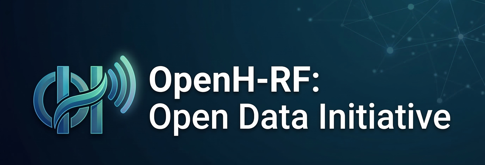

# OpenH-RF

*Enabling advanced ultrasound imaging techniques and evaluation through free, openly available and high-quality ultrasound channel capture data.*

---

## About

OpenH-RF is a collaborative initiative led by **Stanford University**, the **Technical University of Eindhoven** and **NVIDIA** to build a large-scale, openly licensed dataset of pre-beamformed (channel capture) medical ultrasound measurements. *The goal:* train general-purpose foundation models capable of multi-task *raw-to-insight* inference across echocardiography, general, fetal and transcranial imaging, blood flow measurement and ultrasound inverse problems.

We aim to curate **20,000+** real and synthetic channel capture measurements spanning reconstruction, flow, quantitative imaging, motion estimation and interpretation tasks — released under **CC BY 4.0**.

## How to Participate

1. **Review the RFP** — Read the [Request for Proposals](assets/OpenH-RF%20Request%20for%20Proposals%20(RFP).pdf) for technical scope, eligibility and evaluation criteria.
2. **Submit a Proposal** — Prepare a concise proposal (≤ 5 pages) describing your dataset, collection methodology and target tasks. Submit to [this Google Form](forms.gle/tqiqYSnnar1AekB19).
3. **Contribute Data** — Once approved, prepare and deliver your dataset in the OpenH-RF format (specification coming soon).
4. **Co-author the Release** — Approved contributions are included in the public dataset and foundation model release — contributors are named co-authors in related publications upon project completion.

## Key Dates

| Milestone | Date |
|-----------|------|
| RFP released | March 16, 2026 |
| Proposal submission deadline | May 10, 2026 |
| Data collection window | May – July 2026 |
| Model training & validation | August – September 2026 |
| Public release (dataset + foundation model) | October 2026 |

## Steering Committee

| Role | Name | Affiliation |
|------|------|-------------|
| AI Lead | Prof. Ruud J.G. van Sloun | TU Eindhoven |
| Ultrasound Lead | Prof. Jeremy Dahl | Stanford University |
| Industry Lead | Dr. Walter Simson | NVIDIA |

## Contact

- **Technical questions** — [openh.data+rf@gmail.com](mailto:openh.data+rf@gmail.com)
- **Administrative questions** — [wsimson@nvidia.com](mailto:wsimson@nvidia.com)
- **Community** — [Join our Discord](https://discord.gg/gNTJeUsH2B)
