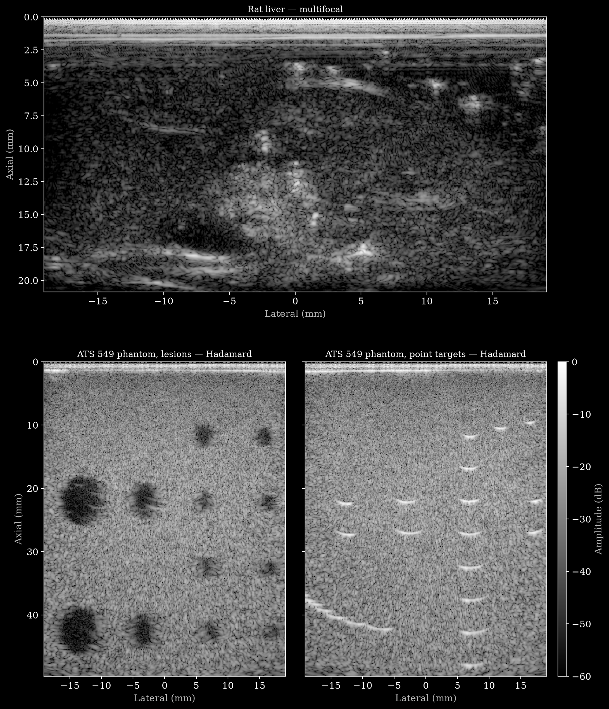

# Stanford Murine Liver and Sound-Speed Phantom Ultrasound



*Frame 0 reconstructed with `reconstruct.py` (L12-3v, 60 dB). Top: the exposed liver of [Rat3](https://huggingface.co/datasets/nvidia/OpenH-RF/blob/main/stanford-murine/data/RatExperiments/VerasonicsAcq/Rat3/ExposedLiver/DATA_Tracks_20190319_115804.hdf5), `multifocal` track. Bottom: the ATS 549 phantom's [lesions](https://huggingface.co/datasets/nvidia/OpenH-RF/blob/main/stanford-murine/data/SoSExperiments/august13_2020/L12_3v/ATS_phantom/lesion/DATA_Tracks_20200813_164505.hdf5) and [point targets](https://huggingface.co/datasets/nvidia/OpenH-RF/blob/main/stanford-murine/data/SoSExperiments/august13_2020/L12_3v/ATS_phantom/point_target/DATA_Tracks_20200813_164745.hdf5), `hadamard` track. The point targets curve into arcs because the phantom is beamformed at 1540 m/s while its own sound speed is lower — the mismatch this dataset is built to estimate and correct.*

## Dataset Description

This dataset contains pre-beamformed pulse-echo ultrasound channel data from murine livers and sound-speed phantoms. The data were acquired on a Verasonics Vantage 256 using multifocal, Hadamard-encoded, and full synthetic aperture (FSA) transmit sequences. The dataset supports research on beamforming, sound-speed estimation, and aberration correction; it is not intended for clinical diagnosis.

The source data are available from Figshare:

- [Murine liver acquisitions](https://doi.org/10.25452/figshare.plus.28291985)
- [Sound-speed phantom and meat-layer acquisitions](https://doi.org/10.25452/figshare.plus.28291988)

The original Figshare releases were published under Apache 2.0; this converted release is CC BY 4.0.

The converted dataset is hosted at [nvidia/OpenH-RF/stanford-murine](https://huggingface.co/datasets/nvidia/OpenH-RF/tree/main/stanford-murine).

## Dataset Contributor(s)

The source datasets were created at Stanford University (Dahl Lab):

- Arsenii V. Telichko
- Rehman Ali
- Andrew Andrzejek
- Thurston Brevett
- Benjamin N. Frey
- Brian Boitnott
- Jihye Baek
- Louise Zhuang
- Hoda Hashemi
- Jun Hong Park
- Caelia Thomas
- Jeremy Dahl <jjdahl@stanford.edu> (contact)

## Dataset Creation Date

06/18/2025, the publication date of both source Figshare records.

## License / Terms of Use

[Creative Commons Attribution 4.0 International (CC BY 4.0)](https://creativecommons.org/licenses/by/4.0/legalcode.en). Retain attribution and identify modifications when reusing the data.

## Intended Usage

The data are intended for development and validation of:

- pulse-echo ultrasound beamforming;
- local and global sound-speed estimation;
- aberration correction through tissue or meat layers; and
- comparisons among multifocal, Hadamard-encoded, and FSA acquisition schemes.

The provided pipeline is a reference delay-and-sum B-mode reconstruction, not a prescribed preprocessing pipeline for model training.

## Dataset Characterization

### Data Collection Method

The collection combines in-vivo and post-mortem animal acquisitions with table-top phantom acquisitions:

- The murine study contains liver scans from 20 Zucker rats: 4 lean controls and 16 obese animals used as a model of hepatic steatosis.
- The phantom study contains an ATS 549 phantom and six agarose/graphite phantoms with varying n-propanol concentration. Many acquisitions include a 10–15 mm porcine or galline meat layer as a controlled aberrator.

### Labeling Method

No image, pixel-wise segmentation, or manual annotation labels are supplied. Rat-level sound-speed, fat-percentage, and histopathology measurements are derived from the source quantification workbooks when available. Phantom sound speeds were measured independently with a through-transmission setup.

### Acquisition System

All acquisitions use a Verasonics Vantage 256 research scanner. The converted demo covers:

| Probe | Geometry | Elements | Center frequency | Sampling frequency |
|---|---|---:|---:|---:|
| C5-2v | Curved | 128 | 4.0 MHz | 15.625 MHz |
| L12-3v | Linear | 192 | 6.0 or 7.813 MHz | 25.0 or 31.25 MHz |
| L12-5 | Linear | 256 | 7.5 MHz | 31.25 MHz |

Each output file bundles three tracks named `multifocal`, `hadamard`, and `synthetic_aperture`. Transmit delays, transmit apodization, focal distances, origins, receive initial times, probe geometry, acquisition sound speed, and sampling frequencies are read from the corresponding MAT file. For the rat acquisitions, the Verasonics sound-speed setting is 1540 m/s; this is retained in `scan/sound_speed` for reconstruction. It is distinct from the post-acquisition liver sound-speed measurements described below.

## Processing the Dataset

The acquisitions can be processed with the `pipeline_multifocal.yaml`, `pipeline_hadamard.yaml` and `pipeline_synthetic_aperture.yaml` definitions in this folder and the [zea library](https://github.com/tue-bmd/zea). Each file bundles three tracks, one per transmit sequence (`multifocal`, `hadamard`, `synthetic_aperture`), and each track has its own pipeline.

`zea` streams the data from the Hugging Face Hub and processes it according to the pipeline; pass the matching track with `--track`. You can try it out with the following command:

```bash
zea process \
  --dataset hf://nvidia/OpenH-RF/stanford-murine/data/RatExperiments/VerasonicsAcq/Rat3/ExposedLiver/DATA_Tracks_20190319_115804.hdf5 \
  --config hf://nvidia/OpenH-RF/stanford-murine/pipeline_synthetic_aperture.yaml \
  --track synthetic_aperture \
  --n-frames 1
```

Alternatively, you can use the `reconstruct.py` [script](https://github.com/open-h/OpenH-RF/blob/main/datasets/stanford-murine/reconstruct.py) as provided in the [OpenH-RF GitHub repository](https://github.com/open-h/OpenH-RF). It reconstructs the first frame of every track in `ZEA_FILE` with the same pipelines and writes one image per track to `assets/`. On top of the YAML, the script inserts a baseband FIR low-pass after demodulation, with its cutoff at half the probe bandwidth (4.0 MHz for L12-3v, 3.0 MHz for L12-5, 1.3 MHz for C5-2v). The cutoff depends on the probe, so it is not part of the pipeline YAMLs and `zea process` runs without it; the difference is small on the rat acquisitions and clearly visible at depth on the phantoms.

## Dataset Format

[zea v0.1.4](https://github.com/tue-bmd/zea)

Converted data use the zea HDF5 representation. Channel samples have dimension order:

```text
(n_frames, n_tx, n_ax, n_el, n_ch)
```

The converter:

1. reads every acquired Verasonics receive-buffer frame, limited to the sample interval referenced by each sequence's Receive metadata;
2. coherently averages duplicate physical elements from overlapping receive apertures while retaining full amplitude for elements recorded once;
3. decodes the positive/negative Hadamard acquisitions;
4. trims axial samples that are zero across every frame, transmit, element, and channel; and
5. stores the resulting RF channel data as `float32`.

The `float32` dtype is intentional. Coherent aperture averaging can create half-integer samples, and Hadamard decoding can exceed the `int16` range. Saving decoded RF as `int16` would round or overflow valid samples.

Reconstructed B-mode images and segmentation masks are not stored in the converted files. They are generated separately by the validation pipeline.

## Dataset Quantification

**Current OpenH-RF release:** 245 HDF5 files; 328.99 GB (328,985,804,800 bytes) stored; root `zea_version` **0.1.4**. Sizes include all HDF5 contents and use decimal units (MB = 10^6 bytes, GB = 10^9 bytes, TB = 10^12 bytes), not decoded-array memory or original-source download sizes.

The original four-file demo (not the complete HF release summarized above) contains four HDF5 acquisition bundles: one Rat9 bundle and one phantom bundle for each of C5-2v, L12-3v, and L12-5. Each bundle has three sequence tracks, and each track retains every frame in its source MAT file. That demo has 12 tracks and 64 frames and occupies approximately 5.5 GiB; HDF5 writer and compression versions may change the exact byte count.

The two complete source Figshare records contain approximately 491.9 GB in total. No train, validation, or test split is defined. The current converted-release size and file count are reported above; the scripts do not assign learning splits.

Representative `raw_data` shapes in the demo are:

| Acquisition | Multifocal | Hadamard | FSA |
|---|---|---|---|
| Rat9, L12-3v | `(2, 576, 847, 192, 1)` | `(2, 192, 847, 192, 1)` | `(10, 192, 847, 192, 1)` |
| Phantom, C5-2v | `(10, 256, 2432, 128, 1)` | `(10, 128, 2432, 128, 1)` | `(10, 128, 2432, 128, 1)` |
| Phantom, L12-3v | `(2, 576, 1613, 192, 1)` | `(2, 192, 1613, 192, 1)` | `(10, 192, 1613, 192, 1)` |
| Phantom, L12-5 | `(2, 512, 2018, 256, 1)` | `(2, 256, 2018, 256, 1)` | `(2, 256, 2018, 256, 1)` |

The Rat9 multifocal sequence uses the three focal depths programmed in the source MAT file: 17.74, 29.57, and 41.39 mm. Its programmed imaging range extends to 50.46 mm, so all three foci are intentional. The stored RF tensor ends near 21.24 mm because samples beyond that depth are zero across every transmit and receive channel and the converter removes this all-zero tail. The focal metadata are retained even when a focus lies beyond the remaining nonzero RF support.

Core per-track features are:

| Name | Shape | Dtype | Units | Description |
|---|---|---|---|---|
| `data/raw_data` | `(n_frames, n_tx, n_ax, n_el, n_ch)` | `float32` | arbitrary RF units | Decoded pre-beamformed channel data |
| `scan/initial_times` | `(n_tx,)` | `float32` | s | Receive A/D start time for each transmit |
| `scan/t0_delays` | `(n_tx, n_el)` | `float32` | s | Per-element transmit delays |
| `scan/tx_apodizations` | `(n_tx, n_el)` | `float32` | unitless | Per-element transmit weights and Hadamard polarity |
| `scan/focus_distances` | `(n_tx,)` | `float32` | m | Transmit focal distance |
| `scan/transmit_origins` | `(n_tx, 3)` | `float32` | m | Transmit origins in `(x, y, z)` order |
| `scan/sampling_frequency` | scalar | `float32` | Hz | RF sampling frequency |
| `scan/center_frequency` | scalar | `float32` | Hz | Transmit center frequency |
| `scan/demodulation_frequency` | scalar | `float32` | Hz | Carrier used for RF-to-IQ demodulation |
| `scan/sound_speed` | scalar | `float32` | m/s | Verasonics acquisition/reconstruction sound speed |
| `probe/probe_geometry` | `(n_el, 3)` | `float32` | m | Element coordinates in `(x, y, z)` order |

## Subject Metadata

The source murine cohort contains 4 lean Zucker rats (2 male and 2 female) and 16 obese Zucker rats (8 male and 8 female), beginning at 13 weeks of age. The obese animals were fed a high-fat diet for up to eight weeks. Converted rat files store the rat identifier and, when present in the source workbooks, sex, fat percentage, measured liver sound speed, weight, diet duration, and histopathology-derived values.

Values with standard DataSpec fields are stored under `metadata/subject`:

| Name | Dtype | Units | Description |
|---|---|---|---|
| `fat_percentage` | `float32` | % | Mean measured liver fat percentage |
| `weight` | `float32` | kg | Animal weight, converted from workbook grams |
| `sex` | string | unitless | Sex reported by the source workbook |

Other workbook measurements are scalar `float32` datasets under `custom/rat_quantification/`, each with `unit` and `description` attributes. These include the ground-truth sound-speed mean and standard deviation, sequence-specific local and global sound-speed estimates, liver-lobe sound-speed measurements when available, diet duration, fat-percentage uncertainty, water temperature, and quantitative histopathology scores. The workbook's non-fat percentage is omitted because it is exactly `100 - metadata/subject/fat_percentage` for every rat. These measurements are scalars rather than homogeneous `sos_map` images because the source provides no spatial coordinates for these rat-level measurements.

The phantom data contain no human subjects. Phantom identifiers describe the probe, material configuration, meat layer, and acquisition session. The source records report independently measured phantom and meat-layer sound speeds and temperature-dependent uncertainties.

## Data Validation

The reference pipelines reconstruct the first stored frame of each track: RF demodulation, delay-and-sum beamforming without pressure-field weighting, envelope detection, maximum normalization and log compression, shown over a 60 dB dynamic range. The grid is derived at three pixels per acoustic wavelength over the acquired aperture and depth. `reconstruct.py` adds the probe-dependent baseband FIR described in [Processing the Dataset](#processing-the-dataset); without it, `zea process` and `reconstruct.py` produce the same image. The figure at the top of this card shows the `multifocal` track of Rat3 and the `hadamard` track of two ATS 549 acquisitions, reconstructed with `reconstruct.py`. `assets/main.png` is the same Rat3 `multifocal` reconstruction on its native grid, without axes.

## Known Issues

- The demo MAT files store `Receive/TGC` profile index 1 but do not store the selected profile's `TGC/Waveform`. A profile index is not a gain curve, so the converter omits the optional `scan/tgc_gain_curve` field rather than inventing a unity curve. The RF samples already reflect acquisition-time TGC, but that gain cannot be calibrated or undone from these files alone.
- Respiratory motion affected early in-vivo rat acquisitions. Later acquisitions were made shortly after euthanasia, as described by the source record and associated publication.
- The source record notes settling and slight inhomogeneity in phantom 4 and phantom 5.
- Strong meat/phantom interfaces and curved-probe reverberation can dominate individual B-mode images. Reconstruction limits preserve the acquired depth rather than cropping those regions automatically.
- The data contain no image or segmentation ground truth.

## Ethical Considerations

No human data are included. The murine study was approved by Stanford University's Institutional Administrative Panel on Laboratory Animal Care. Animals were scanned under 2% isoflurane anesthesia on a heated platform with continuous temperature monitoring; the associated publication describes the euthanasia and tissue-measurement procedures. The public sources do not state an approval number or explicit ARRIVE 2.0 compliance.

The phantom acquisitions require no human- or animal-subject approval. Both Figshare records confirm that no human personally identifiable information is present.

## Citation

Please cite the applicable source dataset and its associated publication:

- Telichko, A. V. et al. (2025). *Pulse-Echo Ultrasound Murine In Vivo Acquisitions*. Figshare+. <https://doi.org/10.25452/figshare.plus.28291985.v1>
- Ali, R. et al. (2025). *Pulse-Echo Ultrasound Sound Speed Phantom and Meat Aberrating Layer Acquisitions*. Figshare+.
  <https://doi.org/10.25452/figshare.plus.28291988.v1>
- Telichko, A. V. et al. “Noninvasive Estimation of Local Speed of Sound by Pulse-Echo Ultrasound in a Rat Model of Nonalcoholic Fatty Liver.” *Physics in Medicine & Biology* 67(1), 015007 (2022).
  <https://doi.org/10.1088/1361-6560/ac4562>
- Ali, R. et al. “Local Sound Speed Estimation for Pulse-Echo Ultrasound in Layered Media.” *IEEE TUFFC* 69(2), 500–511 (2022).
  <https://doi.org/10.1109/TUFFC.2021.3124479>
